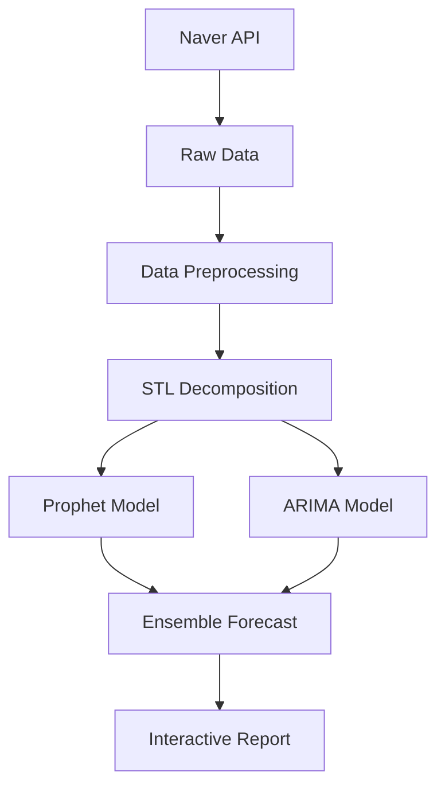

**📘 프로젝트 개요**  
2025 라이프스타일 트렌드 예측 시스템은 **Naver 검색 데이터**를 기반으로 인테리어 트렌드를 분석/예측하는 E2E 파이프라인입니다. STL 분해, Prophet, ARIMA 모델을 활용해 3가지 키워드(`Cost-Effective`, `HomeAppliances`, `UncommonStyle`)의 2025년 검색량 패턴을 예측합니다.

[ + ARIMA (단기 패턴) 조합
- **자동 리포트**: HTML 리포트 & 대시보드 생성 (예시: [트렌드 리포트](./modeling/reports/trend_insights.html))

---

## 🛠 설치 및 실행
```bash
# 1. 저장소 복제
git clone https://github.com/Yeongsoo-Jang/2025-LifeStyleTrend-Analysis.git
cd 2025-LifeStyleTrend-Analysis

# 2. 가상환경 설정
python -m venv .venv
source .venv/bin/activate  # Linux/Mac
.\.venv\Scripts\activate   # Windows

# 3. 의존성 설치
pip install -r requirements.txt

# 4. 메인 파이프라인 실행
python modeling/run_phase2.py
```

---

## 📊 시스템 아키텍처


---

## 🔧 기술 스택

| 그룹           | Prophet | ARIMA | 앙상블 |
|----------------|---------|-------|--------|
| Cost-Effective | 0.82    | 0.78  | 0.85   |
| UncommonStyle  | 0.89    | 0.81  | 0.91   |

 © 2025 장영수  
**문의**: [포트폴리오](https://github.com/Yeongsoo-Jang) | 9135jys@gmail.com