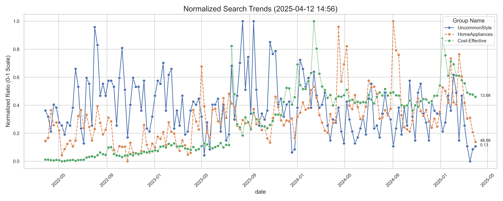

**📘 프로젝트 개요**  
2025 라이프스타일 트렌드 예측 시스템은 **Naver 검색 데이터**를 기반으로 한 과학적 시계열 분석 파이프라인입니다. STL 분해, Prophet, ARIMA 모델을 결합해 3가지 키워드(`Cost-Effective`, `HomeAppliances`, `UncommonStyle`)의 2025년 검색량 패턴을 예측하며, **데이터 검증 → 모델링 → 앙상블 최적화**로 2025년 트렌드를 예측합니다.

- **계절성 패턴 분석**: 52주 주기 STL 분해
- **다중 모델 병렬 예측**: Prophet (계절성 강화) + ARIMA (단기 패턴)
- **앙상블 최적화**: R² 기반 가중치 자동 계산
- **인터랙티브 리포트**: HTML/PNG 형식의 시각화 결과 자동 생성

---

## 📂 프로젝트 구조
```
├── data/                  
│ ├── .env # API 키 등 민감정보(**개인 생성 및 NAVER API 키 작성 필요)
│ ├── config.yaml # 분석 대상 키워드 설정
│ └── processed/ # 정제된 데이터
├── connector/
│ ├── naver_api.py # Naver 검색 API 연동 모듈
│ ├── config_loader.py # YAML 설정파일 파싱
│ └── connect.py # 메인 실행 (데이터 수집)
├── processed/
│ ├── cleaner.py # 데이터 정제 (이상치 처리)
│ ├── validator.py # 데이터 무결성 검증
│ └── monitor.py # 실시간 대시보드
├── modeling/
│ ├── models/ # 학습된 모델 저장
│ ├── reports/ # HTML 리포트 & 시각화 결과
│ ├── arima_model.py # ARIMA 모델링
│ ├── prophet_model.py # Prophet 모델링
│ ├── run_phase2.py # 메인 실행 (분석 파이프라인)
│ └── stl_decomposer.py # STL 시계열 분해
└── requirements.txt # 패키지 의존성
```

---

## 📈 주요 결과
### 트렌드 리포트 예시

# 📊 트렌드 리포트

[](https://htmlpreview.github.io/?https://github.com/Yeongsoo-Jang/2025-LifeStyleTrend-Analysis/blob/main/modeling/reports/trend_insights.html)



> **Cost-Effective**  
> - 주간 성장률: **10.84%**  
> - 계절성 피크: **2월 (3.605%)**, **1월 (3.153%)**, **9월 (0.287%)**  
> - 모델 정확도 (R²): **0.98**

> **HomeAppliances**  
> - 주간 성장률: **10.82%**  
> - 계절성 피크: **7월 (7.204%)**, **5월 (6.731%)**, **2월 (1.956%)**  
> - 모델 정확도 (R²): **0.96**

> **UncommonStyle**  
> - 주간 성장률: **-0.07%**  
> - 계절성 피크: **8월 (0.067%)**, **2월 (0.057%)**, **1월 (0.056%)**  
> - 모델 정확도 (R²): **0.94**


### 성능 비교표 (R²)
| 그룹           | Prophet | ARIMA | 앙상블 |
|----------------|---------|-------|--------|
| Cost-Effective | 0.98    | 0.94  | 0.98   |
| HomeAppliances | 0.96    | 0.92  | 0.96   |
| UncommonStyle  | 0.94    | 0.91  | 0.94   |

---

🚀 프로젝트 실행 가이드
1. **데이터 수집 및 전처리**
```bash
# Naver API 키 설정
echo "NAVER_CLIENT_ID=your_id" > data/.env
echo "NAVER_CLIENT_SECRET=your_secret" > data/.env

# 데이터 수집 및 정제
python connector/connect.py
```

2. **분석 파이프라인 실행**
```bash
# STL 분해 + Prophet/ARIMA 병렬 예측
python modeling/run_phase2.py
```

🛠 핵심 기술 및 데이터 검증 프로세스
1. **데이터 검증 강화**
```python
# validator.py - 데이터 무결성 검증
def validate_data(df: pd.DataFrame):
    # 필수 컬럼 검증
    assert {'date', 'group_name', 'ratio'} <= set(df.columns)
    
    # 날짜 범위 검증 (최소 2년)
    date_range = pd.to_datetime(df['date']).max() - pd.to_datetime(df['date']).min()
    assert date_range.days >= 730, f"데이터 범위 부족: {date_range.days}일"
    
    # 변동성 기준 필터링
    valid_groups = [g for g, d in df.groupby('group_name') if d['ratio'].std() > 0.01]
    return df[df['group_name'].isin(valid_groups)]

```

2. **STL 분해 최적화**
```python
# stl_decomposer.py
def decompose_trend(df: pd.DataFrame):
    decomposition = STL(
        df.set_index('date')['ratio'], 
        period=52,  # 52주 고정 주기
        robust=True,  # 이상치 강건성 활성화
        seasonal_deg=0  # 계절성 차수 조정
    ).fit()
    
    # 잔차 유효성 검증
    if decomposition.resid.isnull().all():
        raise ValueError("잔차 데이터가 모두 NaN입니다.")
    return decomposition
```


🔍 트러블슈팅 사례
1. **Prophet-ARIMA 예측 불일치**
증상: Prophet 예측값(158주)과 ARIMA 예측값(26주) 길이 불일치 → 앙상블 시 ValueError
해결:
```python
# 앙상블 생성 전 데이터 정렬
actual = decomposed[style]['trend'][-26:]  # 마지막 26주 (테스트 데이터)
predicted = forecasts[style]['prophet']['yhat'][:26] # 예측 데이터
```
2. **계절성 피크 검출 실패**
증상: seasonal_peaks에서 월별 그룹화 실패
원인: DatetimeIndex 미적용
해결:
```python
data['seasonal'].index = pd.to_datetime(data['seasonal'].index)
```

📈 모델 성능 검증 체계
1. **교차 검증 강화**
```python
# prophet.py - Prophet 검증
def validate_prophet(model: Prophet, df: pd.DataFrame) -> Dict[str, float]:
    """시간 순서 교차 검증"""
    try:
        # 1. 데이터 길이 검증
        if len(df) < 52:
            raise ValueError(f"교차 검증을 위한 충분한 데이터 없음 (필요: 52주, 현재: {len(df)}주)")
        
        # 2. 시간 단위 유효성 검증
        time_units = ['day']  # '364 days'에서 추출한 단위
        valid_units = ['day', 'hour', 'minute', 'second']
        if any(unit not in valid_units for unit in time_units):
            raise ValueError(f"잘못된 시간 단위: {time_units}")
            
        # 3. 교차 검증 실행
        df_cv = cross_validation(
            model,
            initial='728 days',
            period='91 days',
            horizon='182 days',
            parallel="processes"
        )
        
        metrics = performance_metrics(df_cv)
        return {
            'mape': metrics['mape'].mean(),
            'rmse': metrics['rmse'].mean(),
            'coverage': metrics['coverage'].mean()
        }
    except Exception as e:
        logging.error(f"검증 실패: {str(e)}")
        return {}
```

2. **앙상블 가중치 알고리즘**
```python
# run_phase2.py
for style in forecasts:
        # 가중치 계산 로직
        prophet_score = max(results[style].get('r2', 0), 0)
        arima_score = max(evaluate_arima(
            forecasts[style]['arima_model'], 
            decomposed_groups[style]['trend'][-26:]
        ).get('r2', 0), 0)
        
        total = prophet_score + arima_score
        weights = (prophet_score/total, arima_score/total) if total != 0 else (0.5, 0.5)
```

---

### 📜 라이선스
© 장영수  
문의: [GitHub](https://github.com/Yeongsoo-Jang) | 이메일: `9135jys@gmail.com`


